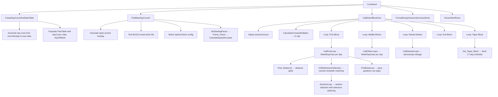

# Marathon Training Plan Generator

A browser-based marathon training plan generator that reproduces the behaviour of the Excel/VBA "Training Block Template V9" tool.

> **Migration complete:** the production app is now the Next.js + Auth.js + Vercel Blob app in [`/web`](./web). It covers multi-user accounts, server-side Strava sync, and an intercepting-route day view. Open `/web/README.md` for how to run it, and `PRODUCTIONISATION_PLAN.md` for the migration history.
>
> The vanilla-JS app documented below remains in the repo as the reference implementation for the engine and the UI behaviour it was ported from. Firebase has been decommissioned; the legacy app still runs via `open index.html` but saves only to localStorage and has no Strava sync (use `/web` for that). Users with legacy localStorage data can import it at `/migrate` in the new app.

## Quick Start

Open `index.html` in a browser (or serve with any static server):

```bash
# Option A: just open the file
open index.html

# Option B: use a static server
npx serve .
# or
python3 -m http.server 8080
```

## Architecture

```
├── index.html                  # Entry point
├── styles/
│   ├── tokens.css              # Design tokens (colors, typography, spacing)
│   ├── components.css          # Reusable component styles
│   └── app.css                 # App-specific overrides
├── src/
│   ├── app.js                  # Main bootstrap, routing, event handlers
│   ├── store.js                # State management + multi-plan localStorage persistence
│   ├── strava.js               # Disabled stub (Strava sync lives in /web)
│   └── ui/
│       ├── components.js       # Reusable UI helpers (badges, icons, formatters)
│       └── renderers.js        # Screen renderers (create, dashboard, weekly, day, settings)
├── engine/                     # Pure logic (DOM-free, testable)
│   ├── planGenerator.js        # Main orchestrator — generateTrainingPlan()
│   ├── dateScaffold.js         # Date generation (next Monday → race date)
│   ├── blockOptimizer.js       # 8/10/12-week block fitting with taper anchor
│   ├── mileageProgression.js   # Exponential growth rate calculation
│   ├── distanceAllocation.js   # Weekly distance splits (long run, intensity, base)
│   ├── sessionSelector.js      # Session template matching with tolerance widening
│   ├── paceEngine.js           # Pace table lookups + guidance string generation
│   ├── taperProtocol.js        # Final 17-day taper schedule
│   └── weeklySchedule.js       # Day-of-week focus area assignment
├── data/
│   ├── sessionTemplates.json   # 14 session matrix tables (extracted from workbook)
│   ├── paceTables.json         # 65 pace tables (extracted from workbook)
│   ├── config.json             # ConvertedTable + PaceSummary + pace index mapping
│   └── extracted_data.json     # Combined raw extraction (reference)
├── tools/
│   ├── extract-from-excel.js   # Node script for re-extracting from workbook
│   └── validate-against-excel.md # How to compare outputs
├── tests/
│   ├── index.html              # Full grouped test suite (inline tests; Run/Export/Clear log)
│   ├── testRunner.html         # Legacy test runner — loads engine.spec.js
│   ├── engine.spec.js          # Engine unit tests used by testRunner.html
│   └── engine_spec.js          # Orphaned older copy — not referenced by any HTML
└── README.md
```

## Workbook Inventory (Phase A1)

### Input Cells (Sheet: "Weekly Breakdown")
| Cell | Field | Type |
|------|-------|------|
| E3 | Target Date | Date (dd/mm/yyyy) |
| E4 | Current Sessions | 3, 4, or 5 |
| E5 | Current Mileage (km) | Number |
| E6 | Max Target Mileage (km) | Number |
| E7 | Current PB Distance | String (e.g., "Marathon") |
| E8 | Current PB Pace | Time (hh:mm:ss) |
| E9 | Target Marathon Pace | Time (hh:mm:ss, 10-min increments) |
| E10 | Speed or Endurance | "Endurance" or "Speed" |

### Output Table (Sheet: "MVP")
- **PlanTable** (B3:L end): Day Count, Date, Day of Week, Focus Area, Session Summary, Session Description, Recoveries, Paces, Total Distance, Warm Up, Warm Down

### Session Templates (Sheet: "SessionMatrix")
14 tables: Speed_Pyramid, Speed_ReversePyramid, Speed_MSets, Speed_WSets, Speed_CutDowns, Speed_EvenBlocks, SE_Pyramid, SE_ReversePyramid, SE_MSets, SE_WSets, SE_CutDowns, SE_EvenBlocks, Tempo_EvenBlocks, Tempo_CutDown

Columns: Summary, Details, Recoveries, Stimulus, Session Distance, Total Distance, Reps

### Pace Tables (Sheet: "Training Paces Table")
65 tables covering all pace/style/marathon-time combinations. Each has columns: Upper, Lower, UppeDif, LowerDif.

### Pace Lookup (Sheet: "Paces")
- **ConvertedTable**: 38 distance rows × 13 marathon pace columns (02:30 → 04:30)

### Pace Summary (Sheet: "Lists")
- **PaceSummary**: Maps pace index (1–13) to table names per style (Tempo, SE_Endurance, SE_Speedster, Speed_Endurance, Speed_Speedster)

## VBA Call Flow (Phase A2)



## Assumptions

1. **Random session selection**: The VBA uses `Rnd` (pseudo-random). The web app uses `Math.random()`. Specific session choices will differ between runs, but type and distance range should match.

2. **Pace time arithmetic**: VBA stores paces as Excel Date/Time serial values. The web app converts to seconds for arithmetic. Minor floating-point differences may occur (< 1 second).

3. **Block length first-block calculation**: The VBA computes `blockRoll` differently per block length (12→70, 10→56, 8→42 days for non-first blocks). The first block length adjusts based on startCount and planType.

4. **Session count progression**: The `SessionSetting` sub progressively increases session count based on `sessionDayCumulative > sessionDayLimit`. This is replicated in the web app.

## Running Tests

**Full test suite** — open `tests/index.html` in a browser:
- Block Optimiser (pyramidal logic, constraints, ≤5 blocks)
- Mileage Progression (per-block ramps, peak/deload, 10% cap)
- Distance Allocation (40% long run, 20% intensity, base pool)
- Session Selector (table name routing, per-session intensity targets)
- Taper Protocol (17-day window, specific sessions)
- Date Scaffold
- Results stored in localStorage; exportable as JSON.

**Legacy runner** — open `tests/testRunner.html` for the original engine.spec.js.

## Tools / Validation Scripts

```bash
# Validate sessionTemplates.json: check sum(reps) == Session Distance for every row
node tools/validate-sessionTemplates.js
# Report written to tools/reports/sessionTemplateDistanceReport.json
```

## Data Files

| File | Used by app? | Notes |
|------|-------------|-------|
| `data/sessionTemplates.json` | Yes | 14 session tables, 151 sessions |
| `data/paceTables.json` | Yes | 65 pace tables |
| `data/config.json` | Yes | Pace index mapping |
| `data/races.json` | Yes | Race list for wizard |
| `data/extracted_data.json` | **No** (tooling only) | Raw extraction from Excel workbook; used by `tools/extract-from-excel.js`. Safe to ignore at runtime. |

---

## CHANGELOG

### Engine v3 — 2026-04-05

#### A) Block Optimiser — Rewrite
- **Replaced** fixed single-length block logic with a candidate-search approach.
- Enumerates all sequences of 1–5 blocks from {8, 10, 12} weeks.
- Filters by pyramidal shape constraint (ascending phase ≤+2 weeks per step, single peak, then free descent) or uniform-length fallback.
- Scores candidates: prefers 3 blocks, pyramidal shape, slack in [5,10] days before race.
- `taperStartDayIndex` remains `maxDayCount − 17` (unchanged).
- Returns full `blocks[]` array with `{blockWeeks, sessionWeeks, deloadWeeks, startDayIndex, endDayIndex}`.

#### B) Mileage Progression — Rewrite
- **Replaced** single global growth-rate with per-block ramp rates via `progressWeeklyMileageByBlocks()`.
- Block structure: 8-week → ramp 4 wks + peak 2 wks + deload 2 wks; 10-week → 6+2+2; 12-week → 8+2+2.
- Each block reaches its `blockMaxMileage` for exactly 2 peak weeks, then deloads −20%/−30%.
- `blockMaxMileage` ramps progressively across plan blocks, reaching `userTargetMaxMileage` at the peak block.
- Legacy `calculateGrowthRate` kept for backward compatibility.

#### C) Distance Allocation — Rewrite
- Long run = min(38 km, 40% of weekly total).
- Intensity = 20% of weekly total (rounded), split 50/50 across Tue/Thu.
- `intensityMileage` (meters) now correctly represents **per-session** target for template matching.
- Base = remaining pool; `basePerRunKm` split evenly across base-run days.
- Warm-ups/warm-downs counted as base; long runs counted as base.

#### D) Session Selector — Update
- `selectSession` now returns `reps[]`, `stimulus`, `block`, `summaryNum`, `sessionNum`.
- Session matching uses `Session Distance` (not `Total Distance`); intensity target is per-session meters.

#### E) Plan Generator — Update
- Uses new `blocks[]` array from block optimiser; iterates block-by-block with per-block mileage.
- `getSessionTableName` now receives current block's `blockWeeks` (not a global `planBlockLength`).
- Day objects now carry `block`, `stimulus`, `reps[]` fields from selected sessions.

#### F) UI — Session Detail
- Day detail now shows: **Block**, **Summary**, **Details**, **Recoveries**, **Stimulus**.
- New **Rep Visualisation** graphic: horizontal bars proportional to rep distance, gaps labelled with recovery seconds.
- Recovery parsing handles both `"90 seconds for 600s"` and `"90 seconds for 600/500s"` patterns.

#### G) Testing
- New `tests/index.html` — full grouped test suite with Run/Export/Clear log buttons.
- Test results persisted to `localStorage`; exportable as JSON.
- `tests/engine.spec.js` updated with tests for all new engine behaviour.

#### H) Tools
- New `tools/validate-sessionTemplates.js` — Node script validates `sum(reps) == Session Distance` for all 151 sessions.
- Writes report to `tools/reports/sessionTemplateDistanceReport.json`.
- All 151 sessions pass validation.
